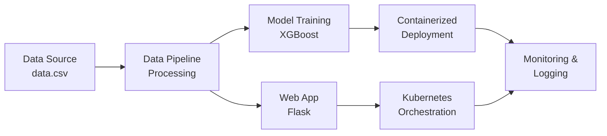

# Australia Weather Rain Prediction - MLOps Project

[](https://www.python.org/downloads/)
[](https://flask.palletsprojects.com/)
[](https://mlops.community/)
[](https://www.docker.com/)
[](https://kubernetes.io/)
[](LICENSE)

A comprehensive Machine Learning Operations (MLOps) project that predicts rainfall in Australia using weather data. This project demonstrates end-to-end ML pipeline implementation with web deployment, containerization, and Kubernetes orchestration.

## 🌟 Project Overview

This project implements a complete MLOps workflow for predicting rainfall in Australia based on various weather parameters. It includes data processing, model training, web application deployment, and infrastructure management using modern DevOps practices.

## 🏗️ Architecture



## 🚀 Features

- **Weather Data Processing**: Automated data preprocessing and feature engineering
- **Machine Learning Pipeline**: XGBoost-based rainfall prediction model
- **Web Application**: Flask-based REST API with user-friendly interface
- **Containerization**: Docker support for consistent deployment
- **Kubernetes Ready**: YAML configurations for container orchestration
- **Logging & Monitoring**: Comprehensive logging system with custom exceptions
- **MLOps Best Practices**: Modular code structure with proper error handling

## 📁 Project Structure

```
CODE/
├── application.py              # Main Flask application
├── requirements.txt            # Python dependencies
├── setup.py                   # Package configuration
├── Dockerfile                 # Docker container definition
├── kubernetes-deployment.yaml # K8s deployment config
├── DATA/
│   └── data.csv              # Raw weather dataset (13MB)
├── src/                      # Core ML modules
│   ├── __init__.py
│   ├── custom_exception.py   # Custom exception handling
│   ├── data_processing.py    # Data preprocessing pipeline
│   ├── logger.py             # Logging configuration
│   └── model_training.py     # ML model training
├── pipeline/                  # Training pipeline orchestration
│   ├── __init__.py
│   └── training_pipeline.py  # Main training pipeline
├── templates/                 # HTML templates
│   └── index.html            # Web interface
├── static/                    # CSS styling
│   └── style.css             # Application styles
├── notebook/                  # Jupyter notebooks
│   └── notebook.ipynb        # Data exploration & analysis
└── artifacts/                 # Generated ML artifacts
    ├── raw/                   # Raw data storage
    ├── processed/             # Processed data
    └── models/                # Trained models
```

## 🛠️ Technology Stack

| Category | Technology | Version/Purpose |
|----------|------------|-----------------|
| **Backend & ML** | Python | 3.9+ |
| | Flask | Web framework |
| | Scikit-learn | ML utilities |
| | XGBoost | Gradient boosting |
| | Pandas & NumPy | Data manipulation |
| | Joblib | Model persistence |
| **Infrastructure** | Docker | Containerization |
| | Kubernetes | Orchestration |
| | Google Cloud Platform | Container registry |
| **Data & Monitoring** | CSV | Data format |
| | Logging | Application monitoring |
| | Custom Exceptions | Error handling |

## 📊 Dataset Information

The project uses Australian weather data with the following features:

### Weather Parameters
- **Temperature**: MinTemp, MaxTemp, Temp9am, Temp3pm
- **Precipitation**: Rainfall, RainToday
- **Atmospheric**: Evaporation, Sunshine, Pressure9am, Pressure3pm
- **Wind**: WindGustDir, WindGustSpeed, WindDir9am, WindDir3pm, WindSpeed9am, WindSpeed3pm
- **Humidity**: Humidity9am, Humidity3pm
- **Cloud Cover**: Cloud9am, Cloud3pm
- **Location**: Geographic location identifier

### Derived Features
- **Year, Month, Day**: Extracted from Date column

### Target Variable
- **RainTomorrow**: Binary classification (0 = NO, 1 = YES)

## 🚀 Quick Start

### Prerequisites

- [Python 3.9+](https://www.python.org/downloads/)
- [Docker](https://docs.docker.com/get-docker/) (optional)
- [Kubernetes cluster](https://kubernetes.io/docs/setup/) (optional)

### Local Development Setup

1. **Clone and Navigate**
   ```bash
   cd CODE
   ```

2. **Install Dependencies**
   ```bash
   pip install -r requirements.txt
   # or
   pip install -e .
   ```

3. **Run Training Pipeline**
   ```bash
   python pipeline/training_pipeline.py
   ```

4. **Start Web Application**
   ```bash
   python application.py
   ```

5. **Access Application**
   - Open browser: http://localhost:5000
   - Enter weather parameters to get rainfall predictions

### Docker Deployment

1. **Build Image**
   ```bash
   docker build -t mlops-app .
   ```

2. **Run Container**
   ```bash
   docker run -p 5000:5000 mlops-app
   ```

### Kubernetes Deployment

1. **Deploy to Cluster**
   ```bash
   kubectl apply -f kubernetes-deployment.yaml
   ```

2. **Check Status**
   ```bash
   kubectl get pods
   kubectl get services
   ```

## 🔧 Configuration

### Environment Variables
| Variable | Description | Default |
|----------|-------------|---------|
| `FLASK_APP` | Flask application entry point | `application.py` |
| `FLASK_ENV` | Environment mode | `development` |

### Model Configuration
| Parameter | Value | Description |
|-----------|-------|-------------|
| **Algorithm** | XGBoost Classifier | Gradient boosting model |
| **Test Split** | 80% training, 20% testing | Data partitioning |
| **Random State** | 42 | Reproducibility seed |

### Web Application
| Setting | Value | Description |
|---------|-------|-------------|
| **Port** | 5000 | Application port |
| **Host** | 0.0.0.0 | External accessibility |
| **Debug Mode** | Enabled | Development features |

## 📈 Model Performance

The XGBoost model provides comprehensive performance metrics:

| Metric | Description |
|--------|-------------|
| **Accuracy** | Overall prediction correctness |
| **Precision** | Weighted precision score |
| **Recall** | Weighted recall score |
| **F1-Score** | Harmonic mean of precision and recall |

## 🔍 API Endpoints

### Web Interface
- **GET/POST** `/`: Main prediction interface
  - Accepts weather parameters via form
  - Returns rainfall prediction (YES/NO)

### Features
- 24 input features for weather prediction
- Real-time model inference
- User-friendly web interface
- Responsive design with modern CSS

## 📝 Logging

The application implements comprehensive logging:

| Feature | Description |
|---------|-------------|
| **Log Directory** | `logs/` |
| **Log Format** | Timestamp, Level, Message |
| **Daily Rotation** | New log file per day |
| **Custom Exception Handling** | Detailed error tracking |

## 🐳 Containerization

### Docker Features
| Feature | Description |
|---------|-------------|
| **Base Image** | Python 3.9 slim |
| **Working Directory** | `/app` |
| **Port Exposure** | 5000 |
| **Package Installation** | Editable install with `-e` flag |

### Kubernetes Features
| Feature | Description |
|---------|-------------|
| **Replicas** | 2 for high availability |
| **Service Type** | LoadBalancer |
| **Port Mapping** | 80 → 5000 |
| **Image Registry** | Google Cloud Container Registry |

## 🔄 MLOps Pipeline

### 1. Data Processing
- Data loading and validation
- Feature engineering (date extraction)
- Missing value handling
- Label encoding for categorical variables
- Train-test split (80/20)

### 2. Model Training
- XGBoost classifier training
- Model persistence (joblib)
- Performance evaluation
- Metrics logging

### 3. Deployment
- Web application serving
- Real-time predictions
- Container orchestration
- Scalable infrastructure

## 🧪 Testing

### Manual Testing
1. Start the application
2. Navigate to web interface
3. Input weather parameters
4. Verify prediction output

### Data Validation
- Check input feature requirements
- Validate numerical ranges
- Handle missing/invalid inputs

## 📊 Monitoring & Maintenance

### Health Checks
- Application status monitoring
- Model performance tracking
- Error rate monitoring
- Resource utilization

### Model Updates
- Retrain with new data
- A/B testing capabilities
- Performance comparison
- Rollback mechanisms

## 🤝 Contributing

We welcome contributions! Please follow these steps:

1. **Fork** the repository
2. **Create** a feature branch (`git checkout -b feature/AmazingFeature`)
3. **Commit** your changes (`git commit -m 'Add some AmazingFeature'`)
4. **Push** to the branch (`git push origin feature/AmazingFeature`)
5. **Open** a Pull Request

### Contribution Guidelines
- Follow PEP 8 style guidelines
- Add tests for new functionality
- Update documentation as needed
- Ensure all tests pass

## 📄 License

This project is developed as part of an MLOps learning initiative.

## 👨‍💻 Author

**Sudhanshu** - MLOps Project Developer

## 🙏 Acknowledgments

- Australian Bureau of Meteorology for weather data
- Open source ML community
- MLOps best practices contributors

## 📞 Support

For questions and support:

| Resource | Description |
|----------|-------------|
| **Logs** | Check the `logs/` directory |
| **Errors** | Review error messages in the application |
| **Data** | Verify data format and model artifacts |

---

> **Note**: This is a demonstration project showcasing MLOps practices. For production use, consider additional security, monitoring, and testing measures.

## 📊 Project Statistics


## 💼 CV Project

This MLOps project demonstrates advanced skills in:
- **Machine Learning Engineering**: End-to-end ML pipeline development with XGBoost
- **DevOps & Infrastructure**: Docker containerization and Kubernetes orchestration
- **Full-Stack Development**: Flask web application with modern UI/UX design
- **Data Science**: Comprehensive data processing, feature engineering, and model evaluation
